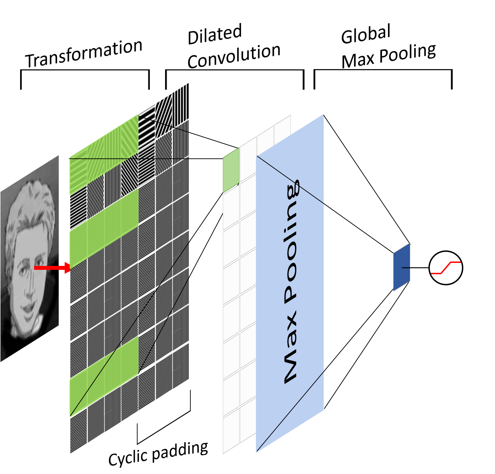

# Rotation-Scale-invariant-CNN
Convolutional neural network (2D index) approximate invariant properties implicitly by max-pooling. Thus filters fail to generalize with drastic changes in scale and rotation. In this page, I show 2D convolution on **`Frequency`** & **`Direction`** is a natural way to think of scale and rotation.

# Background
Fourier transform is a decomposition method that can decompose any function into weighted sum of series of characteristic functions of the heat equation.
In 2D, characteristic functions are wave-like, each wave has two parameters **`Frequency`** and **`Direction`**.

ex: Decomposition of an image `M`

# Pros & Cons

* Pros:
  1. Images size are normalized at preprocessing stage, filters are now capturing patterns between images of different sizes.
  2. GlobalMaxPooling makes pattern recognition simple, no longer need to stack deep convolutional networks.

* Cons:
  1. Fourier series are **not correctly** used here. Obvious, geometric frequency series is not orthogonal. 
     This could be approximately solved by [`Equal Temperament`](#equal-temperament) & `dilation convolution` on Frequency dimension.
  2. Smaller propotional area of the desired pattern in the image gives a weaker signal. I try to adjust it by quadratic growth rewards (see [below](#invariant-properties)).

# Image Preprocessing
Instead of using ,%20k\in%20N),
geometric growth series was used here for scaling property.

In preprocessing stage, images were decompose into linear combination of series of waves with differ frequencies and directions. Store them as a 2D array.

%20+%20b%20\cdot%20sin(\omega)%20=%20\sqrt{a^2+b^2}%20\cdot%20cos(\omega%27)=c%20\cdot%20cos(\omega%27))

Notice that only `c` are considered features. **Ignoring phase parameter is actually a hash method that gives location invariance**, because pattern in different locations are now in the same bucket (feature combination).

Arrange  as a 2D-array with directions in counterclockwise order, frequency in order of size.

* **Q**: How to decide maximum frequency?

  In sampling theory, the estimation of patterns that are more frequent than the sampling frequency might be distorted (Since we don't have Dirac comb).
  
  That is to say, width of pixel could be a reasonable lower bound for period.
  
  This also give a perfect explaination of zero padding — Unobservability of frequencies higher than sampling frequency.

# Invariant Properties

Rotation & scale operation on latents:

If we apply 2D convolution on these feature map, we can see that left-shift of filter on **`Direction`** is a clockwise rotation, up-shift on **`frequency`** means scaling up. 

By choosing a small rotation angle/growth rate, almost all rotationss/scales are considered.

# Equal Temperament

[Equal temperament](https://en.wikipedia.org/wiki/Equal_temperament) are first invented for [harmonic melody](https://www.youtube.com/watch?v=cyW5z-M2yzw&ab_channel=3Blue1Brown), due to its approximation of simple whole number ratio. 

Take 12-ET as example: 

 

Approximate othogonal Fourier series by choosing 12-ET as growth rate and harmonic numbers (0, 12, 19, 24...) as diltaion indice on Frequency dimension.

# Model structure

 

# Experiment

Generated various of rotation, scale, repetition and mask from an image.

Perform a binary classification between generated images and other images.

 

*Kid is a character in [`Yakitate!! Japan`](https://en.wikipedia.org/wiki/Yakitate!!_Japan). You can swap his face to anyone and it will always make sense !!*

* Tests
  1. Test if that trained filter can generalize to images with other rotations & scales.
  2. Test if this filter can capture Kid's face in scenes that Kid appears.

# Filter visualization

# Discussion

* **Pooling**

  Pooling on Direction dimension gives a vagueness to the shape of the pattern.

* **Deeper?**

  Only harmonic dilated filter are approximately othogonal, stacking filters will ruin the structure. But it may give some unexpected results.

* **Challenge**

  If only part of the image shown in the picture, signal maynot strong enough for filters. 
  Need some localization pattern detecting, Which is time domain convolution (traditional one), to detect wave-like pattern.
